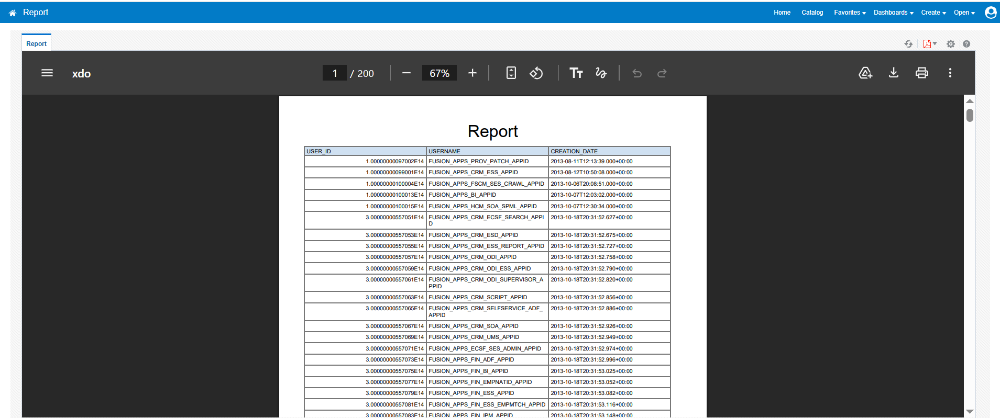

# BIP User Information Report

## Overview

Created a BIP report for basic user information.

The report contains the following fields:

- `USER_ID`
- `USERNAME`
- `CREATION_DATE`

## Data Model

The following query was used to create the data model:

```sql
SELECT USER_ID, USERNAME, CREATION_DATE
FROM PER_USERS;

```
The query result was used as sample data to create the report.

## BIP Report Output

The following screenshot shows the output generated by the BIP report:




## Reference Files

The following files are included for reference:

- Data Model (XDM) catalog file
- Report (XDO) catalog file
- Report Catalog containing both the data model and report
- Report PDF
