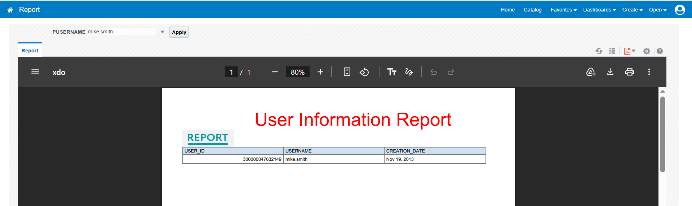
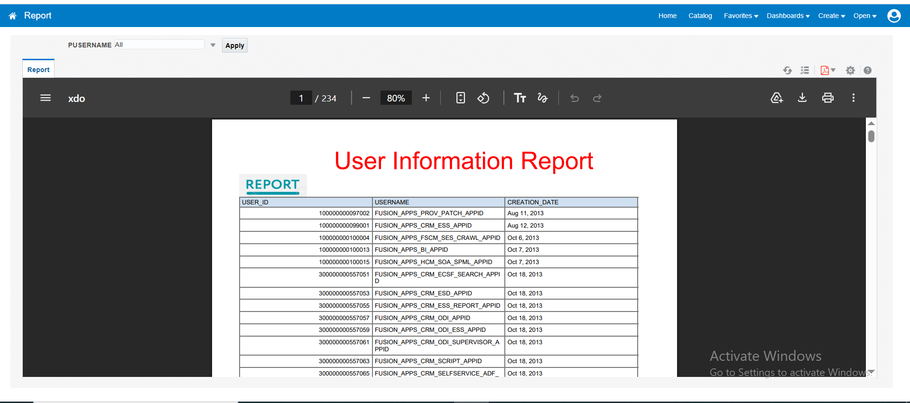
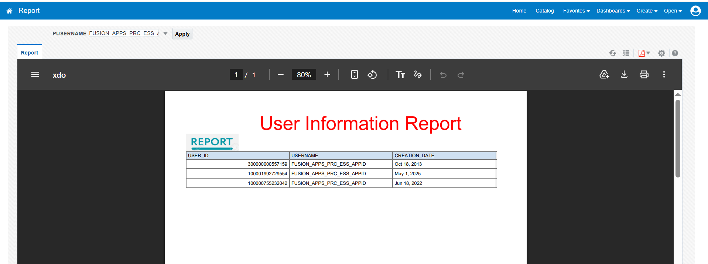

# BIP User Information Report

## Overview

Created a BI Publisher (BIP) User Information Report to display user information from the `PER_USERS` table.
The report includes a parameterized search feature that allows the user to filter the report based on `USERNAME`.
If the username parameter is left NULL, the report displays information for all users.
The report contains the following fields:

* `USER_ID`
* `USERNAME`
* `CREATION_DATE`

The report also includes a logo and a User Information heading in the report output.

## Data Model

The following query was used to create the data model:

```sql
SELECT USER_ID, USERNAME, CREATION_DATE
FROM PER_USERS
WHERE USERNAME = NVL(:PUSERNAME, USERNAME);
```

## Parameter

A parameter named `PUSERNAME` was created in the data model.
The parameter is used to filter the report based on the selected username.

* When a username is selected, the report displays the corresponding user information.
* When the parameter is left `NULL`, the report displays all users.

## List of Values (LOV)

A List of Values (LOV) was created for the `PUSERNAME` parameter to allow users to select a username from a list.
The following query was used to create the LOV:

```sql
SELECT DISTINCT USERNAME
FROM PER_USERS;
```

The LOV provides the available usernames from the `PER_USERS` table.

## Auto Run Configuration

The Auto Run option was disabled for the report.
When the report is opened, the report does not execute automatically, and no results are displayed immediately.
The user must first select a username from the `PUSERNAME` parameter and then run the report to view the results.
This configuration prevents the report from loading the user information until the required parameter selection is made.

## Report
Added logo to the report.
Updated and formatted the report headings for a clear and professional appearance.
Added footer to the report.

## BIP Report Outputs

The following screenshots shows the output generated by the BIP report:






## Reference Files

The following files are included for reference:

* Data Model (XDM) catalog file
* Report (XDO) catalog file
* Report Catalog containing both the data model and report
* Report PDF
